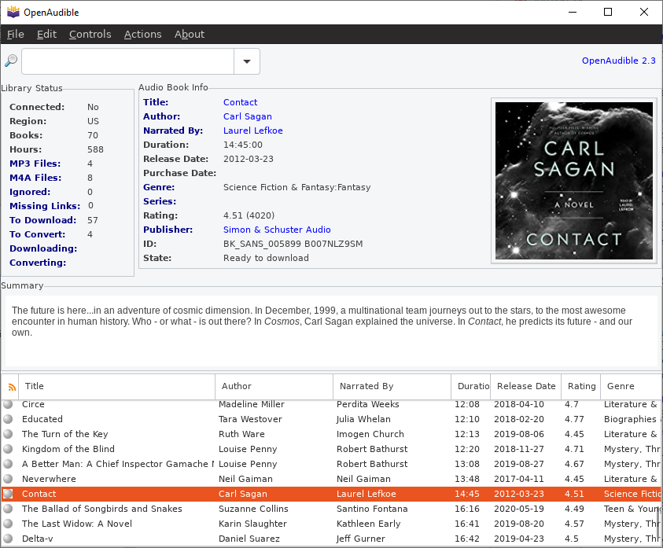

# OpenAudible
A cross-platform desktop application for downloading and managing your Audible audiobooks.

## Latest Binary Release

[Download](https://openaudible.org) installers for Windows, Mac and Linux. (64bit)

More information is available at the project home page [openaudible.org](http://openaudible.org).

## Features
- Import audible books from your account
- Convert to mp3 with all tags
- Import (or Drag and drop) aax files directly into the app
- Display all your books in searchable UI
- Export web page/javascript file with all your books

And many more features have been added.

## Note about Building from source
This open source version 1.1.8 is not the latest available as a binary version. Many new features have been added 
to the closed source binary versions. Give it a try!

## Building
Build this version (1.1.8) from scratch using the [build instructions](BUILD.rm). 

## License
This project is licensed under the Apache 2.0 License - see the [LICENSE.md](LICENSE.md) file for details, but may uses code licensed by other licenses.

We include a minimal LGPL-compliant binary of ffmpeg for audio conversions.

We use Install4J for our multi-platform installer builder. 

Please use responsibly on content you have purchased and are legally authorized to access and back up.
